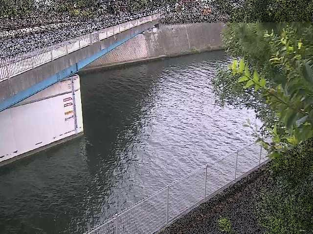

# 境川橋 水位状況

最終更新: 2026-10-20 09:42:12（このページはGitHub Actionsが自動生成しています）

## 🟢 平常（各警戒水位未満）

- 現在水位: **2.03 m**（観測: 2026-10-20 09:30:00）
- 今後3時間の予測降水量（藤沢市周辺）: 約1.8 mm（出典: [Open-Meteo](https://open-meteo.com/)）

## 水位グラフ（実測・予想）

実線=実測水位、破線+帯=予想（不確実性幅）、水平線=警戒水位。予想は直近の上昇トレンドに今後の降雨予報（出典: [Open-Meteo](https://open-meteo.com/)）の強弱を反映したヒューリスティックであり、検証済みの水文モデル（貯留関数法等）ではありません。雨が弱まる予報のときは上昇率が下がり平坦化しますが、水位の下降（減衰）は表現していません（下降モデルを将来検証できるよう、降雨の実測データの蓄積を開始しています）。しきい値の目前（数cm差）で「到達見込みなし」となる場合があるため、下表には予測ピーク値も併記しています。

## 河川カメラ映像

水位が上昇傾向のため、最新映像を掲載しています（撮影時刻: 2026-10-20 09:36:00）。

出典: [横浜市河川監視カメラ](https://mizubousai.city.yokohama.lg.jp/river_camera/rc_details_now.html?lang=ja&wpc=546694)

## 警戒水位（公式基準）と到達予想

| 段階 | 水位 | 到達予想 |
|---|---|---|
| 水防団待機水位 | 4.00 m | 3時間以内では未達予定（予測ピークは約2.50m、あと1.50m） |
| 氾濫注意水位 | 4.50 m | 3時間以内では未達予定（予測ピークは約2.50m、あと2.00m） |
| 避難判断水位 | 5.20 m | 3時間以内では未達予定（予測ピークは約2.50m、あと2.70m） |
| 氾濫危険水位 | 5.65 m | 3時間以内では未達予定（予測ピークは約2.50m、あと3.15m） |

到達予想は上記グラフと同じ予測パス（直近トレンド×降雨予報の比率ヒューリスティック）から算出しています。

## 直近の観測値

| 観測時刻 | 水位(m) |
|---|---|
| 10/20 09:30 | 2.03 |
| 10/20 09:20 | 1.96 |
| 10/20 09:10 | 2.02 |
| 10/20 09:00 | 1.94 |
| 10/20 08:50 | 1.96 |
| 10/20 08:40 | 1.93 |
| 10/20 08:30 | 1.90 |
| 10/20 08:20 | 1.90 |
| 10/20 08:10 | 1.86 |
| 10/20 08:00 | 1.86 |
| 10/20 07:50 | 1.81 |
| 10/20 07:40 | 1.80 |

---

本通知は補助情報です。避難の判断は自治体の公式情報・避難情報に従ってください。

詳細データ: [https://www.pref.kanagawa.jp/sys/suibou/web_general/suibou_joho/html/stage/10/p10202_13_3585_4_309.html](https://www.pref.kanagawa.jp/sys/suibou/web_general/suibou_joho/html/stage/10/p10202_13_3585_4_309.html)

